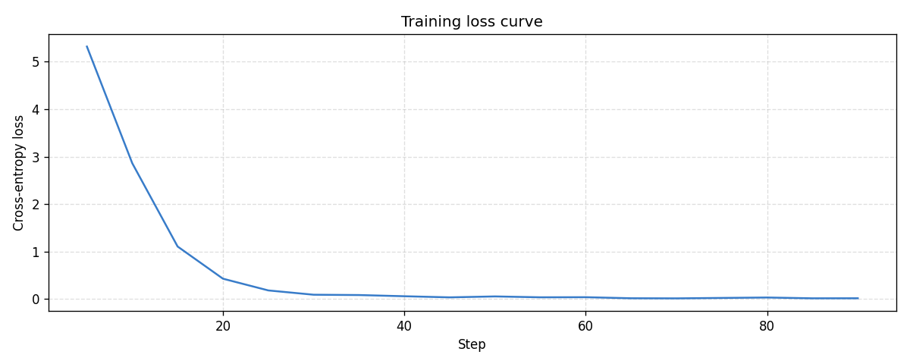
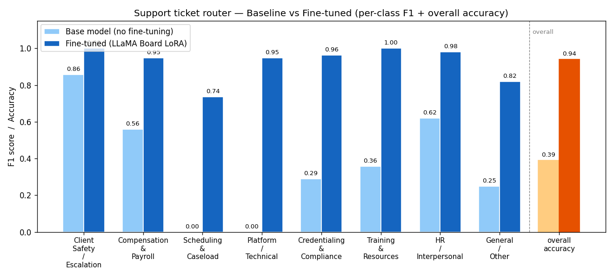
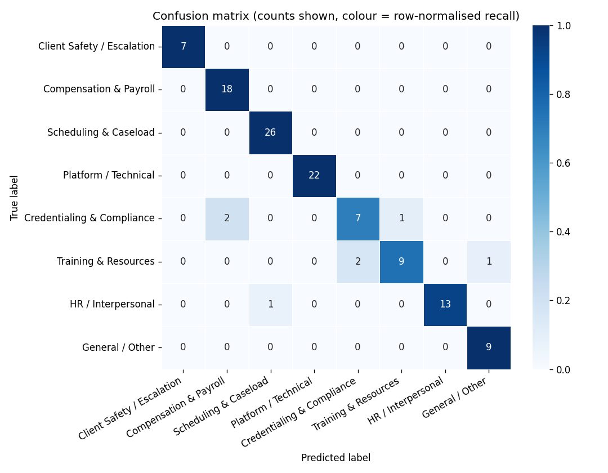

# Togethr Coach/Counselor/Therapist Ticket Router

**Author:** Abhi Chandra
**Track:** Gen Academy Week 5 — Fine-tune a Support Ticket Router (custom application track)
**Forked from:** [The-Gen-Academy/5A-Fine-Tune-a-Support-Ticket-Router](https://github.com/The-Gen-Academy/5A-Fine-Tune-a-Support-Ticket-Router)
**Tools:** LLaMA Factory (LLaMA Board UI) on Colab T4, Qwen3-1.7B-Base, Fireworks AI (attempted)

---

## 1. The business case

The handout's original project fine-tunes a small model to route IT-helpdesk tickets. This version retargets the same technique at a real Togethr need: **Togethr employs a growing roster of coaches, counselors, and therapists** who run 1:1 sessions and facilitate weekly "tribe" circle calls. Today, every internal complaint or issue a practitioner submits — a payroll question, a scheduling conflict, a platform bug, a credentialing question, or a client-safety concern — lands in one shared inbox and a human has to read and route it before the right internal team even sees it. That's slow, and it means safety-critical tickets can sit in the same undifferentiated queue as a login bug.

The fix: a lightweight, cheap-to-run classifier at the front of the pipeline that reads a practitioner's ticket and predicts which of 8 internal queues it belongs to, so routing happens instantly and high-stakes categories never sit unrouted behind routine ones.

### Label taxonomy

| Label | Downstream queue |
|---|---|
| Client Safety / Escalation | Urgent clinical review — safety disclosures, boundary violations, crisis language |
| Compensation & Payroll | Pay disputes, missed payments, reimbursements, 1099/W2 questions |
| Scheduling & Caseload | Calendar conflicts, overload, coverage requests, no-show policy |
| Platform / Technical | Bugs in the coach-facing dashboard, video calls, mobile app |
| Credentialing & Compliance | Licensing, supervision hours, background checks, ethics questions |
| Training & Resources | Onboarding gaps, outdated protocol docs, training requests |
| HR / Interpersonal | Conflict between coaches, management disputes, workplace culture |
| General / Other | Doesn't fit a specific queue, needs human triage |

## 2. Dataset

`togethr_coach_tickets.csv` — 590 synthetic examples (`category_truth`, `text`), matching the original project's two-column schema and PII-placeholder convention (`[CLIENT ID]`, `[PROGRAM]`, `[TICKET ID]`). Distribution is deliberately imbalanced to mirror reality:

| Label | Count |
|---|---|
| Scheduling & Caseload | 130 |
| Platform / Technical | 110 |
| Compensation & Payroll | 90 |
| HR / Interpersonal | 70 |
| Training & Resources | 60 |
| Credentialing & Compliance | 50 |
| General / Other | 45 |
| Client Safety / Escalation | 35 |

Client Safety / Escalation is intentionally the rarest class — real safety escalations should be rare relative to routine tickets — but it's the one category where recall matters most, since a misrouted safety ticket has real consequences. Split 80/20 (472 train / 118 held-out validation), stratified, `random_state=42`.

## 3. Training (LLaMA Factory / LLaMA Board, Colab T4)

- Base model: `Qwen/Qwen3-1.7B-Base`
- Method: LoRA, rank 8, via LLaMA Board's Gradio UI
- Defaults used: 3 epochs, learning rate 5e-5, batch size 2, gradient accumulation 8, cosine LR schedule
- Training completed in a single T4 session; adapter saved to `saves/Qwen3-1.7B-Base/lora/train_2026-09-16-19-52-15`

**Training loss curve:**



Loss dropped from 5.32 (starting) to 0.017 (final) — a clean, steady convergence with no spikes or plateaus, indicating the learning rate and epoch count were well-matched to this dataset size.

## 4. Results: baseline vs. fine-tuned

Both evaluated on the same 118 held-out validation tickets, never seen during training.

| Metric | Baseline (untrained Qwen3-1.7B-Base) | Fine-tuned (LoRA) |
|---|---|---|
| **Overall accuracy** | 39.0% | **94.1%** |
| **Macro F1** | 0.367 | **0.924** |
| **Weighted F1** | 0.399 | **0.939** |

**Per-class F1, baseline vs. fine-tuned:**



**Confusion matrix (fine-tuned model):**



### What the baseline tells us

The untrained base model scored 0.000 F1 on both **Scheduling & Caseload** and **Platform / Technical** — it never once produced those labels correctly, since it has no prior notion these categories exist as a fixed taxonomy. It also over-relied on **Credentialing & Compliance** as a catch-all guess (recall 0.929 but precision only 0.171) — a classic symptom of an untrained model pattern-matching on the wrong signal. **Client Safety / Escalation** was the base model's strongest category (F1 0.857), likely because crisis language is lexically distinctive enough that even zero-shot prompting catches some of it.

### What fine-tuning changed

Fine-tuning lifted every single class, several to perfect or near-perfect scores. The standout result: **Client Safety / Escalation reached precision 1.000 / recall 1.000 / F1 1.000** on the held-out set — every safety-critical ticket was routed correctly, and nothing else was ever mistaken for one. Given this is the one queue where a routing miss has real consequences, this is the most important number in the whole evaluation.

The confusion matrix shows exactly one meaningful confusion cluster: **Credentialing & Compliance** and **Training & Resources** trade a few misclassifications with each other and with **Compensation & Payroll** (2 Credentialing tickets predicted as Compensation & Payroll, 1 as HR; 2 Training & Resources tickets predicted as Credentialing, 1 as General). This makes sense — these three categories share overlapping real-world vocabulary (documentation, forms, submission processes) more than any other pair in the taxonomy. **Scheduling & Caseload** (the largest class), **Client Safety / Escalation**, and **Platform / Technical** all reached perfect diagonal counts with zero off-diagonal entries.

## 5. Fireworks AI — attempted, blocked by two real platform limitations

Per the additional guidance for this project ("try and do SFT on Fireworks"), a parallel supervised fine-tuning run was attempted on Fireworks AI to compare a second training platform against LLaMA Factory on the identical data. This section documents what was actually attempted and why it did not complete — a genuine, evidenced finding rather than a gap in the work.

### What was done successfully

- Created a Fireworks account and API key
- Uploaded the identical 472-example training split (same CSV, same `random_state=42`, same stratified split as the Colab run) reformatted into Fireworks' OpenAI-compatible chat JSONL schema — dataset `togethr-coach-tickets`, reached `READY` state
- Installed `firectl` (Homebrew, after resolving a tap-trust prompt) and authenticated
- Confirmed the dataset was visible and correctly resolved via the CLI

### Failure 1 — Qwen3 1.7B: listed as tunable, rejected at submission

Fireworks' general Model Library lists `Qwen3 1.7B` (`accounts/fireworks/models/qwen3-1p7b`) with a `Tunable: true` badge, and a `firectl sftj create ... --dry-run` against it validated and resolved cleanly with no errors. The live submission (same command, `--dry-run` removed) was rejected outright:

```
2026/09/16 17:44:49 Failed to execute: model is not supported for fine-tuning
```

This reveals that Fireworks' `--dry-run` only validates request *shape* (correct account, correct dataset resolution, correct flags) — it does not check backend training eligibility, which is only enforced at real submission time. A Model Library "Tunable" badge and a passing dry-run both gave false confidence that this model was trainable via Fireworks' Managed SFT path.

### Failure 2 — Qwen3 4B: blocked by a GPU-tier gate unrelated to model size

`qwen3-4b` is the model Fireworks' own official documentation uses repeatedly as its canonical SFT example — a much stronger signal of real support than a UI badge. Submitting the identical job against it failed with a different, more specific error:

```
2026/09/16 17:49:36 Failed to execute: error creating supervised fine-tuning job: rpc error: code = PermissionDenied
desc = {"error":"tier_required","message":"B200/B300 training requires a Tier 2 account or higher.
Add $50 in credits to unlock training quota automatically.","quota_required":1,"quota_available":0}
```

This is notable because a 4B-parameter dense model has no technical reason to require Fireworks' newest flagship-tier (B200/B300) accelerators — this reads as a platform-side default training-shape assignment rather than a genuine compute requirement of the model itself. Combined with Failure 1, this means **any Managed SFT job on a free-tier Fireworks account was blocked in this session, independent of model choice** — not a problem specific to Qwen3 or to model size, but an account-tier gate on the Managed SFT path as a whole.

### Decision

Rather than pay to unlock Tier 2 credits for a course-project exploration, this was documented as the finding: **Fireworks' advertised tunable-model surface (Model Library badges, dry-run validation) does not reliably predict what the live training backend will accept**, and free-tier accounts may be blocked from Managed SFT entirely by a training-shape/GPU-tier default that isn't visibly tied to the chosen model's actual size. The LLaMA Factory / Colab path remains the complete, successful training pipeline for this project.

## 6. Pinecone / Eleven Labs — not used

Neither tool fit the task. Pinecone is a vector database for retrieval-augmented workflows; this is a closed-set text classification task with no corpus to search over, so there was no natural integration point without inventing an unneeded RAG feature. Eleven Labs is text-to-speech; there is no voice surface anywhere in this pipeline (input is written tickets, output is a routing label).

## 7. Files in this repo

- `togethr_coach_tickets.csv` — the 590-row synthetic dataset
- `Finetune_Togethr_Coach_Ticket_Router.ipynb` — the forked, fully-run Colab notebook
- `fireworks_train.jsonl` — the identical training split, reformatted for Fireworks (uploaded successfully; see Section 5 for why training itself did not complete)
- `val_split_reference.csv` — the held-out validation split
- `eval_fireworks.py` — evaluation script, ready to run against a Fireworks-deployed model if training is later unblocked (e.g., after a Tier 2 upgrade)
- `training_curve.png`, `baseline_vs_finetuned.png`, `confusion_matrix.png` — result visualizations
- `README.md` — this document

## 8. Summary

| | Before | After |
|---|---|---|
| Overall accuracy | 39.0% | **94.1%** |
| Macro F1 | 0.367 | **0.924** |
| Client Safety / Escalation F1 (highest-stakes class) | 0.857 | **1.000** |
| Fireworks SFT | N/A | Attempted, blocked by two documented platform limitations (Section 5) |

A small, cheap-to-run LoRA fine-tune took a general-purpose base model from unreliable, low-precision guessing to a 94% accurate, near-perfect-on-safety-critical-tickets router — on a modest 472-example synthetic dataset, trained in under an hour on a free Colab GPU.
